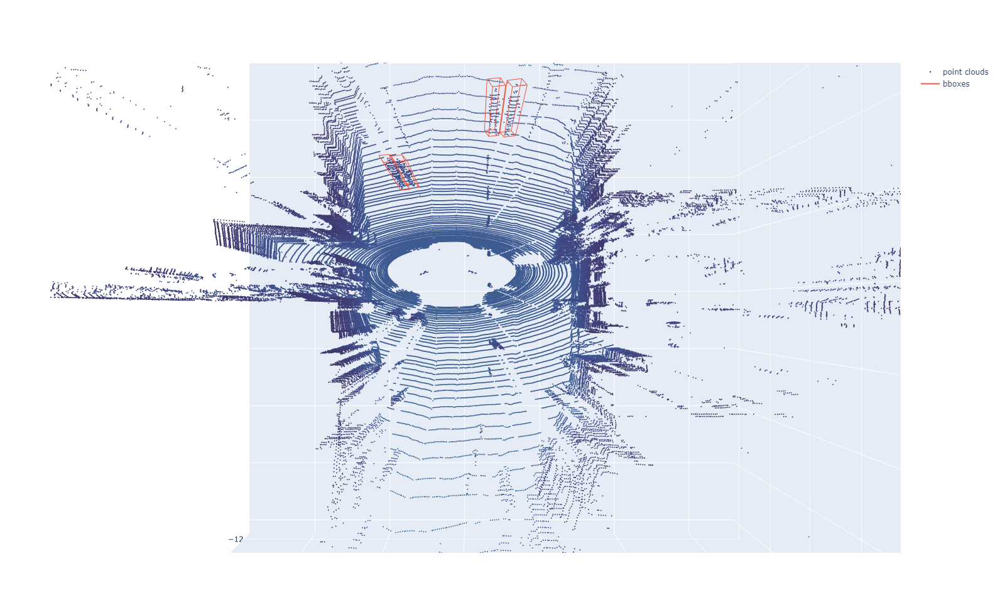
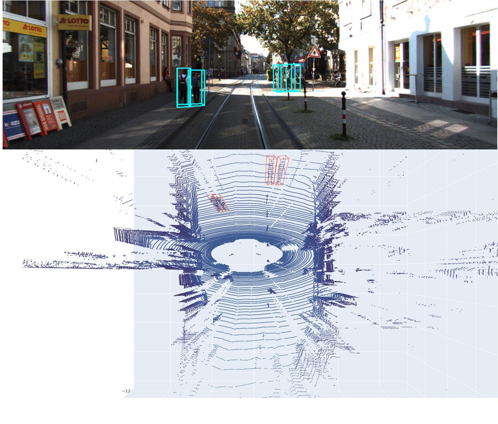

# Visualize Point Clouds (with bbox) by Plotly

## Install

This code just depends on Plotly which can be easily installed.

```shell
pip install plotly
```

## Usage

+ Implement  of base class Visual which can visualize standard data.
+ Implement of KITTY dataset.
+ Other dataset will be update in the future. Welcome to submit a pull request.

Here is an example:


## 3Dbbox_image

run `kitti_object.py` file:

```bash
cd visual_pts
python kitti_object.py
```

Then, get two images:

- 2D bbox in image:

  

- 3D bbox in image

  

run `visual_plotly.py` file:

```bash
python visual_plotly.py
```

it will open browser:



Last, merge two image in Visio:


