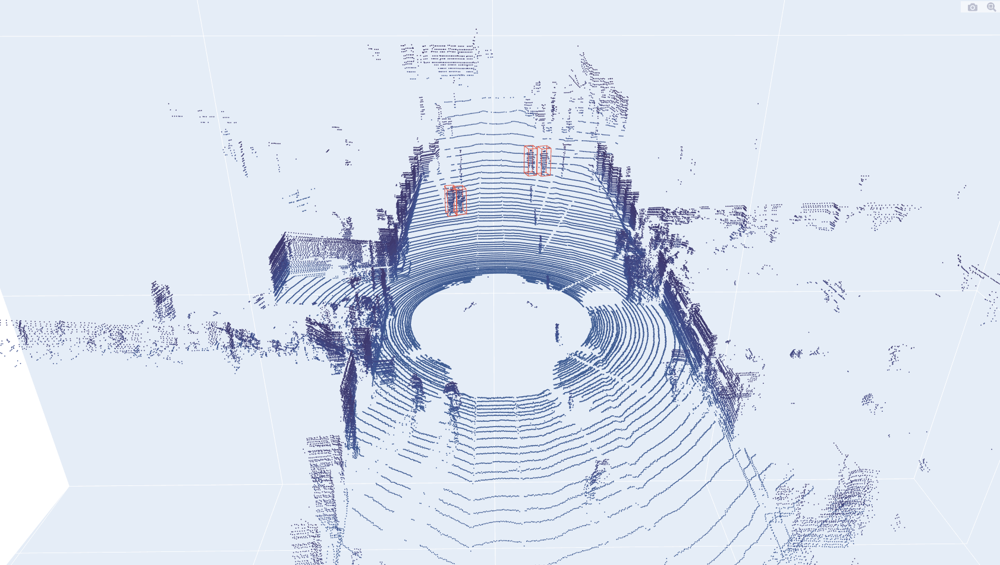
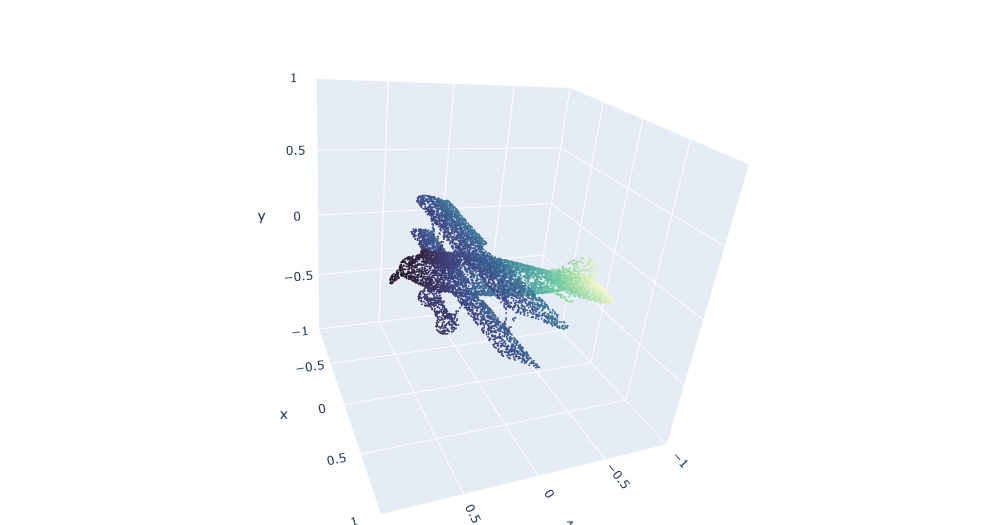

# Visualize Point Clouds (with bbox) by Plotly

## Installation

This code mostly depends on Plotly which can be easily installed.

```shell
pip install visual_pts
```

NOTE: The latest version now is visual_pts==1.4.0

## Getting Started

+ Implement  of base class Visual which can visualize standard data.
+ Implement of KITTY dataset.
+ Other dataset will be update in the future. Welcome to submit a pull request.

You can inference Demo to Visualize.

Here is an example (KITTI 000043):




- You can use the `Point_IO()` to load, save or visualize a ponit cloud, including .xyz, .txt, .asc and .off.



## Contribution

JunbinGao, HaoRuan and LianguangLiu.

Welcome to be a member of the visual_pts development team by contributing to this repo, and feel free to contact us for any potential contributions.

